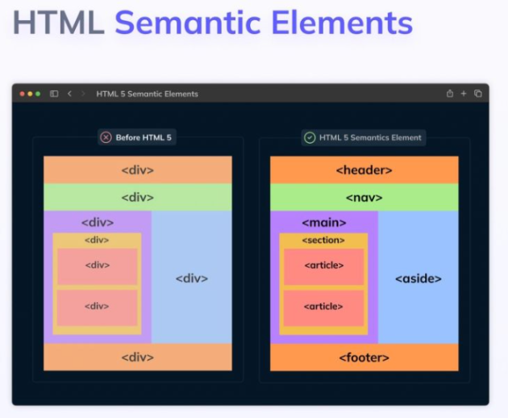
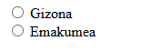
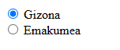
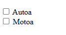
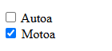
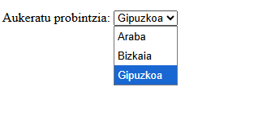
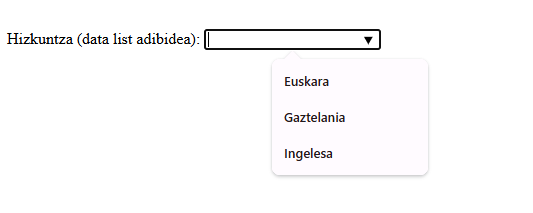
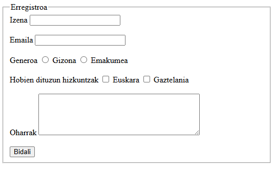

# HTML

HTML5, HTML estandarraren berrikuspenik berriena da eta orriaren edukiari
egitura eta esanahia ematen dioten etiketa semantiko berriak sartzen ditu.

## Zer da HTML?

1. HTMLk **HyperText Markup Language** esan nahi du (hipertestua markatzeko
   lengoaia).
2. **Web-orriak sortzeko lengoaia estandarra** da.
3. Web orri baten **egitura definitzen du**, "etiketak" erabilita.
4. **HTML etiketek elementuak** (testua, irudiak, estekak, etab.) nola
   **erakutsi** behar diren adierazten dute.
5. Ez da programazio-lengoaia bat, markatze-lengoaia bat baizik.
6. **CSS**rekin (diseinurako) eta **JavaScript**ekin (interakziorako) batera
   funtzionatzen du.
7. HTML fitxategiek **.html edo .htm** luzapena dute.

!!! tip "Editorea"
    Kodea idazteko, **[Visual Studio Code](https://code.visualstudio.com/){: target="_blank" rel="noopener" }** erabiltzea gomendatzen da.


    

## Dokumentu baten oinarrizko egitura

```html
<!DOCTYPE html>
<html lang="eu">
<head>
    <meta charset="UTF-8">
    <title>Nire orria</title>
</head>
<body>
    <h1>Kaixo mundua</h1>
</body>
</html>
```

- `doctype`-ak erabiltzen ari den HTML estandarra identifikatzen du.
- `<html>`...`</html>` etiketak dokumentu osoa biltzen du.
- `<head>` metadatuak ditu; `<body>` eduki ikusgaia du.
- `<title>` orriaren titulua ezartzen du (nabigatzailearen fitxan agertzen
  dena).

`<head>` barruko elementu guztiak aukerakoak dira, `<title>` izan ezik:
hori da nahitaez egon behar duen bakarra.

## Atributuak

Etiketen portaera orokorra aldatzen dute (kolorea, lerrokadura,
estiloak...). Atributuaren izenak, `=` ikurrak eta hartzen duen balioak
osatzen dute, komatxo artean idatzita:

```html
<elementu_izena atributu1="balio1" atributu2="balio2">...</elementu_izena>
```


!!! example "Ariketa 1"
    Praktikatzen hasiko dugu, horretarako lehenengo ariketa egingo dugu: [Ariketa 1](https://docs.google.com/document/d/1bX3VveTiWPALXlwyk2_bzWR_Lmldd4CsQWVppNYj1LA/edit?usp=sharing){: target="_blank" rel="noopener" }
    
## Metadatuak (`<head>`)

- `<meta charset="UTF-8">`: sinboloak eta azentuak ondo erakusten direla
  bermatzen du.
- `<meta name="viewport" content="width=device-width, initial-scale=1">`:
  ikuspegia gailu mugikorretan optimizatzen du.
- `<meta name="description" content="...">`: orriaren deskribapena
  (bilatzaileek erabiltzen dutena).
- `<style>`: CSSa zuzenean dokumentuan txertatzeko aukera ematen du.
- `<link rel="icon" sizes="192x192" href="/bidea/ikonoa.png">`: favicon bat
  gehitzen du.
- `<base>`: webgunearen **helbide-erroa** adierazten du, eta horrek orriko
  esteka guztien helbide erlatiboak (`href`, `src`...) helbide-erro
  horretatik abiatuta desegiteko aukera ematen du.

**Bilatzaileen arakatze-kontrola (`robots`):**

```html
<meta name="robots" content="index, follow">
<meta name="robots" content="noindex, follow">
<meta name="robots" content="index, nofollow">
```

- `index, follow`: orria indexatzen du eta bere estekei jarraitzen die.
- `noindex, follow`: ez du indexatzen, baina bai estekei jarraitzen die.
- `index, nofollow`: indexatzen du, baina bere estekak alde batera uzten
  ditu.

**`<head>` osoaren adibidea:**

```html
<head>
    <title>Nire web orria</title>
    <base href="https://www.URL.com/" target="_blank">
    <meta charset="UTF-8">
    <meta name="description" content="Nire web orriari buruz hitz egingo dugu">
    <meta name="keywords" content="HTML, CSS, JavaScript">
    <meta name="author" content="Jone">
    <link rel="stylesheet" type="text/css" href="URL">
</head>
```

## Izenburuak (`<h1>`-`<h6>`) eta marra horizontala

Goiburuek `<h1>`-etik `<h6>`-ra izenburuak tamainaren arabera hertsiki
ordenatzen dituzte, tamainarik handienetik txikienera. Bloke-elementuak
dira.

```html
<body>
    <h1>Goiburua H1</h1><h2>Goiburua H2</h2>
    <h3>Goiburua H3</h3><h4>Goiburua H4</h4>
    <h5>Goiburua H5</h5><h6>Goiburua H6</h6>
</body>
```

`<hr>` etiketak paragrafoak banatzeko marra horizontal bat sortzen du.
`<hgroup>`-ekin batera erabil daiteke, elkarrekin lotutako izenburuak
taldekatzeko:

```html
<body>
    <hgroup>
        <h1>TITULU NAGUSIA</h1>
        <h2>Bigarren titulua</h2>
    </hgroup>
    <p>hau lehen paragrafoa da.</p>
    <hr/>
    <p>hau bigarren paragrafoa da.</p>
</body>
```

## Iruzkinak

Lerro batean edo zenbait lerrotan nabigatzaileak interpretatuko ez dituen
iruzkinak sartzeko balio du: `<!-- edukia -->` moduan idazten dira eta
nabigatzaileak ez ditu erakusten. Iturri-kodea ikusterakoan, ordea,
iruzkin horiek ikusi daitezke.

```html
<!--nireorrialdea.html-->
<html>
<head> ... </head>
<!--Hemen hasten da dokumentuaren gorputza -->
<body> ... </body>
</html>
```

## Testu formatua

## Oinarrizko testu-formatua

HTML5en, **itxura CSSren bidez** definitzea gomendatzen da. Hala ere, badaude esanahi semantikoa ematen duten etiketa batzuk:

| Etiketa | Erabilera |
|---------|-----------|
| `<strong>` | Garrantzi handiko testua (normalean lodiz erakusten da). |
| `<em>` | Enfasia edo azpimarra semantikoa (normalean etzanez). |
| `<b>` | Arreta deitu nahi den testua, esanahi berezirik gabe. |
| `<i>` | Atzerriko hitzak, termino teknikoak edo bestelako testu bereziak. |
| `<u>` | Azpimarratutako testua (erabilera oso mugatua). |
| `<sup>` | Goi-indizea. |
| `<sub>` | Behe-indizea. |
| `<small>` | Aparteko komentarioak; testuaren tamaina txikitzen du (egile-eskubideak bistaratzeko erabili ohi da). |

```html
-- Biak lodiz ikusiko dituzu nabigatzailean, baina ez dute gauza bera esan nahi.
<b>Kaixo</b>

<strong>Kaixo</strong>
-- Biak lodiz idatziko ditu, baina nabigatzaileak bereiztuko du bigarrena garrantzi handiko testua moduan
```

!!! tip
    HTMLk **esanahia** adierazi behar du; **itxura**, berriz, CSSk definitu behar du.

## Paragrafoak eta lerro-jauziak

- `<p>`: paragrafo bat definitzen du.
- `<br>`: lerro-jauzi bat txertatzen du paragrafoaren barruan.

Erabili:

- `<p>` ideia edo gai desberdinak bereizteko.
- `<br>` helbideak, poemak, abestien hitzak edo lerroak bereizi behar diren kasuetan.

Ez da gomendagarria `<br>` erabiltzea paragrafoak bereizteko.

!!! example "Ariketa 2"
    Aurreko guztia praktikatzeko, bigarren ariketa hau sortuko dugu: [Ariketa 2](https://docs.google.com/document/d/1uGno9mUAN5DKdeTdbDz3JHxJCzQ_hNfYbqgqv9hz5GA/edit?usp=sharing){: target="_blank" rel="noopener" }
    

**Laburdurak, definizioak eta aipuak:**

```html
<abbr title="World Wide Web Consortium">W3C</abbr>
```

- `<dfn>`-k definizio bat adierazten du.
- `<blockquote>`-k aipu luze bat markatzen du (bloke gisa).
- `<cite>`-k aipu labur bat markatzen du.

**Testu-aldaketak:**

- `<del>` marratutako testua (ezabatua).
- `<ins>` txertatutako testua (normalean etzanez).
- `<mark>`-k testua nabarmentzen du.
- `<samp>` programa baten adibide-irteera.
- `<tt>` idazmakina/monoespazio estiloa.
- `<wbr>`-k testua *wrap* egitean apurtu daitekeen puntu bat iradokitzen
  du.
- `<output>`-ek kalkulu baten emaitza erakusten du.

## Estiloa `style` atributuarekin

HTMLko edozein etiketarekin batera jarri daiteke `style` atributua,
haren atzean doan testuari itxura aldatzeko. Gaur egun, ordea, letra
baten estiloa **CSSren bitartez** definitzea gomendatzen da, ez etiketan
bertan.

Estilo-atributuan erabiltzen diren propietate ohikoenak: `background-color`,
`color`, `font-family`, `font-size`, `text-align`.

```html
<p style="text-align:center; color:red">kaixo</p>
```

!!! example "Ariketa 3"
    Aurreko ariketa hartuko dugu eta formato pixkatxo bat emango diogu: [Ariketa 3](https://docs.google.com/document/d/1-elSPF7C4rMSja-fL5CdYVIvKhH__P7gnhU4qNS9XNc/edit?usp=sharing){: target="_blank" rel="noopener" }
    

## Zuriuneak

Nabigatzaileek jatorrizko kodeko zuriune anitzak eta lerro-jauziak zuriune
bakar batean tolesten dituzte. Espazioa kontrolatzeko:

- `&nbsp;`-k apurtu ezin den zuriune bat sortzen du (zuriune gogorra).
- `<br/>`-k lerro-jauzia behartzen du.
- `<p>`-k paragrafo logikoak bereizten ditu.

## HTML entitateak

| Entitatea | Emaitza | Esanahia |
|---|---|---|
| `&lt;` | < | baino txikiagoa |
| `&gt;` | > | baino handiagoa |
| `&amp;` | & | ampersand |
| `&copy;` | © | copyright |
| `&trade;` | ™ | marka komertziala |
| `&reg;` | ® | marka erregistratua |
| `&euro;` | € | euroa |
| `&yen;` | ¥ | yena |
| `&quot;` | " | komatxoak |
| `&aacute;` / `&Aacute;` | á / Á | a azentuduna |
| `&eacute;` / `&Eacute;` | é / É | e azentuduna |
| `&iacute;` / `&Iacute;` | í / Í | i azentuduna |
| `&oacute;` / `&Oacute;` | ó / Ó | o azentuduna |
| `&uacute;` / `&Uacute;` | ú / Ú | u azentuduna |

!!! note
    Etiketak `<` eta `>` ikurrekin zehazten direnez, ikur horiek testuan
    bertan idatzi behar direnean anbiguotasuna sor daiteke; horregatik
    erabili behar dira `&lt;` eta `&gt;` bezalako kodeak zuzenean `<`/`>`
    idatzi ordez.

## Aurreformateatutako testua

- `<pre>`-k nabigatzailea jatorrizko kodearen zuriuneak eta lerro-jauziak
  errespetatzera behartzen du.
- `<kbd>`-k erabiltzaileak teklatuz sartutako testua adierazten du.
- `<var>`-k aldagai bat adierazten du.
- `<code>`-k programazio-kodea markatzen du.

## Zerrendak

**Zerrenda ordenatuak eta ez-ordenatuak:**

```html
<ol>
    <li>Lehen elementua</li>
    <li>Bigarren elementua</li>
</ol>

<ul>
    <li>Ordenik gabeko elementua</li>
    <li>Beste elementu bat</li>
</ul>
```

Zerrendak beste zerrenda batzuen barruan habiaratu daitezke; era
guztietakoak nahas daitezke (ordenatuak, desordenatuak eta definizioak).

**Zerrenda desordenatuen itxura (`list-style-type`):**

CSSren `list-style-type` propietateak zerrenda desordenatuen bulet-itxura
aldatzen du:

- `disc`: lehenetsia, biribil beltza.
- `circle`: biribila (hutsik).
- `square`: karratua.
- `none`: bulet gabe.

**Zerrenda ordenatuen atributuak:**

| Atributua | Balioa | Deskribapena |
|---|---|---|
| `reversed` | `reversed` | Zerrenda beherantz antolatzen du (9, 8, 7...). |
| `start` | zenbakia | Zein zenbakitan hasi adierazten du. |
| `type` | `1 \| A \| a \| I \| i` | Bulet mota jartzeko: `1` zenbaki arruntak, `A` hizki larriak, `a` hizki xeheak, `I` zenbaki erromatar larriak, `i` zenbaki erromatar xeheak. |

**Definizio-zerrendak:**

```html
<dl>
    <dt>Terminoa</dt>
    <dd>Terminoa deskribatzen duen definizioa</dd>
</dl>
```

!!! example "Ariketa 4"
    Praktikak jarriko dugu ikusitako zerrenda guztiak, horretarako hurrengo ariketa hau egingo dugu: [Ariketa 4](https://docs.google.com/document/d/1pveaqygPBLPr78U9XzY_ine5uHqWn9uhMmzeColxKY8/edit?usp=sharing){: target="_blank" rel="noopener" }
    

!!! example "Ariketa 5 (Errepasoa)"
    Errepaso ariketa hau egingo dugu, taulekin hasi aurretik: [Ariketa 5](https://docs.google.com/document/d/1yNLnRmuh3gRfOAYjq5qQ2CAdDA78987bK7IwfbBcPkw/edit?usp=sharing){: target="_blank" rel="noopener" }

    Errepaso ariketa egiteko, testu hau beharko dugu: [Ariketa5_Testua.txt](https://drive.google.com/file/d/1BURGxTBSFa6vFExP35HiloBQfq5gmY2Y/view?usp=sharing){: target="_blank" rel="noopener" }
    
## Estekak (`<a>`)

WWWaren indarra orri batetik bestera salto egiteko gaitasunean datza:
orri batetik bestera erraz nabiga daiteke, eta informazioa berehala
eskuratu, esteken bidez. Estekak `<a>` elementuarekin egiten dira:

```html
<a href="estekaren helbidea" target="_blank">Estekaren testua</a>
```

**Helbide erlatiboak:** demagun proiektua honela antolatuta dagoela:

```
01_PROIEKTUA/
├── hasiera.html
├── nire_orria1.html
├── nire_orria2.html
├── nire_orria3.html
└── 01_ARGAZKIAK/
    ├── argazkien_orria.html
    └── ikonoa
```

`hasiera.html`-tik gainerako orriak estekatzeko:

```html
<a href="nire_orria1.html" target="_self">Lehenengo orria</a>
<br>
<a href="nire_orria2.html" target="_blank">Bigarren orria</a>
<br>
<a href="nire_orria3.html" target="_self">Hirugarren orria</a>
```

Argazkien orria `01_ARGAZKIAK` azpikarpetan dagoenez, bertara joateko
esteka honela idatzi behar da:

```html
<a href="01_ARGAZKIAK/argazkien_orria.html" target="_blank">Argazkien orria</a>
```

Nabigatzaileak beti eusten dio lanean gauden orriaren helbideari. Beraz,
`argazkien_orria.html`-tik `hasiera.html`-ra itzultzeko, karpeta batetik
gora egin behar da `../` erabilita:

```html
<a href="../hasiera.html" target="_self">Hasiera orria</a>
```

**`target` atributua:**

| Balioa | Deskribapena |
|---|---|
| `_blank` | Leiho edo fitxa berrian irekitzen du. |
| `_self` | Klik egindako fitxa berean irekitzen du (lehenetsia). |
| `_parent` | Jatorrizko fitxan irekitzen du. |
| `_top` | Orriaren gorputz-atal osoan irekitzen du. |
| `frame-izena` | Zehaztutako fitxa (*frame*) jakinean irekitzen du. |

**`rel` atributua:** estekaren eta dokumentuaren arteko harremana
adierazten du.

| Balioa | Esanahia |
|---|---|
| `alternate` | Beste euskarri batean dagoen bertsioa (inprimatzeko orria, itzulita...). |
| `author` | Dokumentuaren egilearen esteka. |
| `bookmark` | "Gogokoak" atalean erabiltzen den URLa. |
| `external` | Kanpoko esteka. |
| `help` | Laguntza-dokumentuaren esteka. |
| `license` | Lizentzia-dokumentuaren esteka. |
| `next` | Hurrengo dokumentura jotzeko esteka. |
| `nofollow` | Jarraituko ez den esteka. |
| `noreferrer` | Nabigatzaileak HTTPko erreferentziarik gabeko goiburua bidaltzea. |
| `prev` | Aurreko dokumentura jotzeko esteka. |
| `search` | Bilatzaile-erreminta aurkezteko esteka. |
| `tag` | Laneko dokumentuko etiketa batera jotzeko esteka. |

```html
<a rel="nofollow" href="http://www.funcexample.com/">Hegaldi merkeak</a>
```

!!! example "Ariketa 6"
    Estekak lantzeko hurrengo ariketa hau egingo dugu: [Ariketa 6](https://docs.google.com/document/d/1yNLnRmuh3gRfOAYjq5qQ2CAdDA78987bK7IwfbBcPkw/edit?usp=sharing){: target="_blank" rel="noopener" }

**Orri bereko atal batera saltoa:** lehenengo, salto egingo dugun atala
izendatu behar da; ondoren, atal horretara eramango gaituen esteka sortu:

```html
<!-- Dokumentuko atala markatzen da -->
<a name="aurkezpena">AURKEZPENA</a>

<!-- Beste atal batetik aurkezpen-atalera deia -->
<a href="#aurkezpena">Joan AURKEZPEN atalera</a>
```

## Irudiak (``)

Webgunean, erabiltzailearen arreta erakartzeko eta erabiltzeko gogoa
pizteko, irudiak premiazko elementuak dira, baina ezin dira erabili
lizentzia-baimenik gabe. Hainbat irudi-formatu daude:

- **GIF**: kalitaterik gabeko konpresioa du. 256 kolore bakarrik onartzen
  ditu. Grafikoak, marrazkiak edo ikonoak erabiltzeko egokia da (`*.gif`).
- **JPG / JPEG**: konpresioarekin kalitatea galtzen da. 16,7 milioi kolore
  onartzen ditu. Argazkiak kudeatzeko egokia da (`*.jpg` / `*.jpeg`).
- **PNG**: konpresiorik gabeko irudia. 16,7 milioi kolore arteko irudiak
  eta gardenkiak onartzen ditu (`*.png`).

Irudiak sartzeko `` etiketa erabiltzen da, eta ez du amaierako
etiketarik:

```html

```

Hobe da irudi guztiak karpeta batean sartzea, proiektua txukun izateko;
kontuz ibili `src` atributuan sartzen den bidearekin.

**`` etiketaren atributuak:**

| Atributua | Balioa | Deskribapena |
|---|---|---|
| `src` | URLa | Irudiaren URLa. |
| `alt` | testua | Irudia agertu ezean zer testu agertuko den adierazten du. |
| `width` | pixelak | Irudiaren zabalera adierazten du. |
| `height` | pixelak | Irudiaren altuera adierazten du. |
| `longdesc` | URLa | Irudiaren deskripzio zehatzaren URLa ematen du aditzera. |
| `usemap` | `#mapa_izena` | Irudiaren mapa zehazteko. |

**Irudiak estekekin:** web-orrietan asko erabiltzen da irudiak estekekin
konbinatzea (adibidez, iragarki baten irudia). Irudiaren eta estekaren
etiketak batu behar dira:

```html
<a target="_blank" href="estekaren helbidea">
    
</a>
```

**Irudia "ikono" moduan (favicon):** web-orri batek normalean ikono txiki
bat darama. `<head>` atalean sartu behar da:

```html
<link rel="icon" type="image/png" href="images/ikonoa.ico">
```

**Irudi-mapa (`usemap`):** irudi baten gainean eskualde ezberdinei
esteka ezberdinak lotzeko erabiltzen da:

```html

<map name="planetamap">
    <area shape="rect" coords="0,0,82,126" alt="Eguzkia" href="eguzkia.htm">
    <area shape="circle" coords="90,58,3" alt="Merkurio" href="merkurio.htm">
    <area shape="circle" coords="124,58,8" alt="Artizarra" href="artizarra.htm">
</map>
```

!!! example "Ariketa 7"
    Aurreko ariketa hartuta irudi batzuk gehituko dizkiogu: [Ariketa 7](https://docs.google.com/document/d/1_CJtRfB0itwi-28CKiPz1CjdhrMXO0GOdG8Josb7oWc/edit?usp=sharing){: target="_blank" rel="noopener" }

## Taulak

```html
<table>
    <caption>Taularen titulua</caption>
    <thead>
        <tr><th>Izena</th><th>Adina</th></tr>
    </thead>
    <tbody>
        <tr><td>Ana</td><td>25</td></tr>
    </tbody>
    <tfoot>
        <tr><td colspan="2">Guztira: 1 errenkada</td></tr>
    </tfoot>
</table>
```

- `<table>`-k taula osoa biltzen du.
- `<thead>`-ek goiburuko errenkadak ditu, `<th>` gelaxkekin.
- `<tbody>`-k datu-errenkadak ditu, `<td>` gelaxkekin.
- `<tfoot>`-ek oin-errenkadak taldekatzen ditu (totalak, laburpenak...).
- `<caption>`-ek taulari titulua ematen dio.
- `<colgroup>` eta `<col>`-ek zutabe zehatzei informazioa lotzen diete.
- `<tr>`-k errenkada bat definitzen du.

**Gelaxkak batzeko atributuak:**

| Atributua | Balioa | Deskribapena |
|---|---|---|
| `colspan` | zenbakia | Zutabeak gelaxka bakarrean batzeko. |
| `rowspan` | zenbakia | Errenkadak gelaxka bakarrean batzeko. |

Adibidez, `<td colspan="3">` jarriz gero, hiru zutabe batuko dira gelaxka
horretan; `<td rowspan="2">` jarriz gero, berriz, errenkada hori eta
hurrengoa batuko dira gelaxka bakarrean.

!!! example "Ariketa 8"
    Ariketa honetan aurrerago ikusitako elementu guztiak erabiliko ditugu: [Ariketa 8](https://docs.google.com/document/d/10OdWh8rRAqE4MvS2_rgTyeBhYnarij9VyPsRNPoP5fc/edit?usp=sharing){: target="_blank" rel="noopener" } 

!!! warning "Arau garrantzitsua"
    Datu oro, edo baita azpitaula oso bat ere, beti `<td>` gelaxka baten
    barruan egon behar da. Nahitaezkoa da: taulak beste gelaxka batzuen
    barruan habiaratu daitezke maketazio konplexuak eraikitzeko.

## Etiketa semantikoak (HTML5)

HTML5ek **etiketa semantiko berriak** gehitu zituen web-orriak modu argiago eta ulergarriagoan antolatzeko. Horri esker, bai nabigatzaileek, bai bilatzaileek eta baita garatzaileek ere hobeto ulertzen dute orriaren egitura.

> **Garrantzitsua:** etiketa semantikoek ez dute itxura aldatzen berez; edukiari **esanahia** ematen diote.

---

### Orri baten egitura

- `<header>`: orri edo atal baten **goiburua**. Bertan normalean logoa, webgunearen izena edo izenburu nagusia kokatzen dira.
- `<nav>`: **nabigazio-menua**. Beste orri edo atal batzuetara eramaten duten estekak biltzen ditu.
- `<main>`: orriaren **eduki nagusia**.
- `<section>`: gai edo atal jakin batekin lotutako edukia taldekatzen du.
- `<article>`: **eduki independente** bat adierazten du (blog-sarrera bat, albiste bat, produktu baten fitxa...).
- `<aside>`: **eduki osagarria** edo albo-barra. Normalean lotura interesgarriak, iragarkiak edo informazio gehigarria jartzen dira.
- `<footer>`: orri edo atal baten **oin-oharra**. Bertan egilearen informazioa, copyright-a edo kontaktua agertu ohi dira.

```html
<!DOCTYPE html>
<html>
<head>
    <title>Nire webgunea</title>
</head>

<body>

    <header>
        <h1>Nire webgunea</h1>

        <nav>
            <ul>
                <li><a href="#">Hasiera</a></li>
                <li><a href="#">Produktuak</a></li>
                <li><a href="#">Kontaktua</a></li>
            </ul>
        </nav>
    </header>

    <main>

        <section>

            <article>
                <h2>Lehen artikulua</h2>
                <p>Artikuluaren edukia...</p>
            </article>

            <article>
                <h2>Bigarren artikulua</h2>
                <p>Artikuluaren edukia...</p>
            </article>

        </section>

        <aside>
            Informazio osagarria
        </aside>

    </main>

    <footer>
        &copy; 2026 - Nire webgunea
    </footer>

</body>
</html>
```

### Etiketa bakoitzaren azalpena

#### `<header>`

Orri edo atal baten goiburua adierazten du. Normalean honako hauek izaten ditu:

- Webgunearen izena
- Logoa
- Izenburu nagusia
- Nabigazio-menua (askotan `<nav>` barruan)

---

#### `<nav>`

Nabigazio-elementuak biltzen ditu.

Normalean barruan esteken zerrenda bat (`<ul>` eta `<li>`) egoten da, baina irudi edo botoiak ere erabil daitezke.

Adibidez:

- Hasiera
- Guri buruz
- Produktuak
- Kontaktua

---

#### `<main>`

Web-orriaren **eduki nagusia** biltzen du.

Orri bakoitzean **`<main>` bakarra** egon behar da.

---

#### `<section>`

Gai bereko edukia taldekatzen du.

Adibidez:

- Albisteak
- Zerbitzuak
- Produktuak
- Harremanetarako atala

Normalean barruan hainbat `<article>` egoten dira.

---

#### `<article>`

Bere kabuz zentzua duen edukia adierazten du.

Adibide batzuk:

- Blog bateko sarrera
- Albiste bat
- Foro bateko mezua
- Produktu baten deskribapena

Barruan normalean izenburua (`<h2>` edo `<h3>`), testua, irudiak edo bideoak egoten dira.

---

#### `<aside>`

Eduki nagusia osatzen duen informazioa erakusten du.

Adibidez:

- Lotura interesgarriak
- Iragarkiak
- Inkestak
- Azken albisteak

Normalean albo batean kokatzen da.

---

#### `<footer>`

Orriaren edo atal baten amaiera adierazten du.

Bertan agertu ohi dira:

- Copyright-a
- Kontaktua
- Sare sozialetarako estekak
- Lege-oharrak

---

### Edukia antolatzeko etiketak

- `<hgroup>`: elkarrekin lotutako hainbat izenburu taldekatzen ditu.
- `<h1>` - `<h6>`: izenburuen hierarkia ezartzen dute.
- `<div>`: blokeko edukia taldekatzeko etiketa generikoa.
- `<span>`: lerro barruko edukia taldekatzeko etiketa generikoa.

#### `<div>`

Eduki blokeak taldekatzeko erabiltzen da.

Ez du esanahi semantikorik; antolaketa eta estiloa aplikatzeko erabiltzen da batez ere.

#### `<span>`

Testu zati txiki bati estilo edo portaera berezia emateko erabiltzen da.

Ez du lerro-jauzirik sortzen.

```html
<p>
    Hau testu normala da eta
    <span class="gorria">hau gorriz agertuko da</span>.
</p>
```

### Eduki osagarria

- `<address>`: kontaktu-informazioa adierazten du.
- `<details>` eta `<summary>`: informazio zabalgarria sortzen dute.
- `<hr>`: edukien arteko bereizketa tematikoa adierazten du.



!!! tip "Gomendioak"

    ✅ Erabili beti etiketa semantiko egokia.

    ❌ Ez egin web osoa `<div>` etiketen bidez.

    Etiketa semantikoak erabiltzeak honako abantailak ditu:

    - Kode garbiagoa eta ulergarriagoa.
    - Irisgarritasun hobea.
    - SEO hobea.
    - Mantentze-lan errazagoak.

!!! note "Ideia nagusia"
    HTML5eko etiketa semantikoek edukiari **esanahia** ematen diote, ez soilik egitura.


## Eduki txertatua eta multimedia

HTML5ek aukera ematen du **audioa, bideoa eta bestelako multimedia-edukiak** zuzenean web-orrian txertatzeko, pluginik erabili gabe.

Gainera, etiketa hauek nabigatzailearen **erreproduzigailu natiboa** erabiltzen dute, eta JavaScript gehigarririk gabe kontrolak eskaintzen dituzte (erreproduzitu, pausatu, bolumena, denbora-barra...).

---

### Eduki txertatu generikoak (`<object>`)

`<object>` etiketa kanpoko baliabide mota desberdinak txertatzeko erabiltzen da (irudiak, PDFak, dokumentuak...).

```html
<object data="irudia.png" width="550" height="150">
    Irudia ezin izan da kargatu.
</object>
```

---

### Audioa (`<audio>`)

`<audio>` etiketa web-orrian audio-fitxategiak txertatzeko erabiltzen da.

```html
<audio controls src="media/abestia.mp3">
    Zure nabigatzaileak ez du audio txertatua onartzen.
</audio>
```

#### Audio-formatu nagusiak

| Formatua | Azalpena |
|----------|----------|
| **MP3** | Formaturik erabiliena. Nabigatzaile guztiek onartzen dute. |
| **WAV** | Kalitate handikoa, baina fitxategiak oso handiak dira. Audio laburretarako erabiltzen da. |
| **OGG** | Formatu librea. Kalitate ona eta konpresio handia eskaintzen ditu. |

### Hainbat audio-formatu eskaintzea

Nabigatzaile guztiek ez dituzte formatu berdinak onartzen. Horregatik, gomendagarria da `<source>` etiketa erabiltzea.

```html
<audio controls>

    <source src="media/abestia.mp3" type="audio/mpeg">
    <source src="media/abestia.ogg" type="audio/ogg">

    Zure nabigatzaileak ez du audioa onartzen.

</audio>
```

Nabigatzaileak **lehenengo onartzen duen formatua** erabiliko du.

---

### Bideoa (`<video>`)

`<video>` etiketa bideoak zuzenean web-orrian txertatzeko erabiltzen da.

```html
<video controls src="videos/filma.mp4">
    Zure nabigatzaileak ez du bideo txertatua onartzen.
</video>
```

#### Bideo-formatu nagusiak

| Formatua | Azalpena |
|----------|----------|
| **MP4** | Formaturik erabiliena. YouTubek ere gomendatzen du. |
| **WebM** | Weberako optimizatuta dagoen formatu librea. |
| **OGG / OGV** | Formatu librea, nabigatzaile batzuetan erabilia. |

### Hainbat bideo-formatu eskaintzea

```html
<video controls width="640">

    <source src="videos/filma.mp4" type="video/mp4">
    <source src="videos/filma.webm" type="video/webm">

    Zure nabigatzaileak ez du bideoa onartzen.

</video>
```

Nabigatzaileak automatikoki bateragarriena aukeratuko du.

---

### `<audio>` eta `<video>` etiketen atributu erabilienak

| Atributua | Azalpena |
|-----------|----------|
| `controls` | Erreproduzigailuaren kontrolak erakusten ditu. |
| `autoplay` | Orria irekitzean automatikoki hasten da. |
| `loop` | Amaitzean berriro hasten da. |
| `muted` | Hasieran isilduta kargatzen da. |
| `preload` | Multimedia noiz kargatu behar den adierazten du. |
| `width` | Bideoaren zabalera ezartzen du. (`<video>` bakarrik) |
| `height` | Bideoaren altuera ezartzen du. (`<video>` bakarrik) |
| `poster` | Bideoa hasi aurretik erakusten den irudia. (`<video>` bakarrik) |

---

### Kanpoko bideoak txertatzea (`<iframe>`)

YouTube, Vimeo edo antzeko plataformetako bideoak **ez dira `<video>` etiketa erabiliz txertatzen**.

Horrelako kasuetan `<iframe>` erabiltzen da.

```html
<iframe
    src="https://www.youtube.com/embed/XXXXXXXX"
    width="560"
    height="315"
    allowfullscreen>
</iframe>
```

YouTuben bertan, **Partekatu → Kapsulatu (Embed)** aukeran klik eginez lortzen da kode hau.

---

!!! tip "Gomendioak"

    ✅ Erabili beti **MP3** audioetarako eta **MP4** bideoetarako, bateragarritasun handiena eskaintzen dutelako.

    ✅ Erabili `<source>` etiketa formatu bat baino gehiago eskaini nahi baduzu.

    ✅ Gehitu beti ordezko testu bat (`Zure nabigatzaileak...`) multimedia onartzen ez duten nabigatzaileentzat.

    ✅ Errespetatu multimedia-fitxategien **egile-eskubideak**. Interneten aurkitzen den guztia **ez da libreki erabil daitekeena**; egiaztatu beti lizentzia (adibidez, Creative Commons).

!!! example "Ariketa 9"
    Ariketa hau aurreko guztia errepasatzeko balioko zaigu: [Ariketa 9](https://docs.google.com/document/d/11uI0NrI0OdJXkDNqBq0T9JxlLd77c4mzLti7Q4yVel4/edit?usp=sharing){: target="_blank" rel="noopener" } 


## Formularioak

Formularioak erabiltzailearen informazioa jasotzeko erabiltzen dira (erregistroak, saio-hasierak, kontaktu-formularioak, inkestak...).

Formulario baten barruan hainbat kontrol egon daitezke: testu-koadroak, pasahitzak, aukerak, botoiak, zerrendak...

---

### `<form>` etiketa

Formulario guztiak `<form>` etiketa barruan definitzen dira.

```html
<form action="/bidali" method="post">

    <!-- formularioaren kontrolak -->

</form>
```

#### Atributu nagusiak

| Atributua | Azalpena |
|-----------|----------|
| `action` | Datuak bidaliko diren helbidea. |
| `method` | Datuak bidaltzeko metodoa (`get` edo `post`). |

!!! note "Oharra" 
    Oraingoz ez dugu zerbitzaririk erabiliko; beraz, `action` atributuak ez du benetako funtziorik izango.
    Baina atributu honetan esango dugu zein izango den formularioaren elementuak jasoko dituen fitxategia

---

### `<label>`

Formulario bateko kontrol bati izena emateko erabiltzen da.

`for` atributuak kontrolaren `id` atributuarekin bat etorri behar du.

```html
<label for="izena">Izena:</label>
<input type="text" id="izena" name="izena">
```

--- 

### `id` eta `name`

Bi atributuak oso garrantzitsuak dira, baina **ez dute gauza bera egiten**. Haien arteko ezberdintasuna zein den argi geratu behar da.

| Atributua | Zertarako erabiltzen da? |
|-----------|--------------------------|
| `id` | Elementua modu bakarrean identifikatzeko. `<label>` etiketarekin lotzen da. |
| `name` | Formularioa bidaltzean datuaren izena izango da. |

Adibidea:

```html
<label for="izena">Izena</label>

<input
    type="text"
    id="izena"
    name="izena">
```

Kasu honetan:

- `for="izena"` → `id="izena"` atributuarekin lotzen da.
- `name="izena"` → zerbitzariari bidaliko zaion datuaren izena izango da.

---

### Testu-eremua (`text`)

Testu laburrak idazteko erabiltzen da.

```html
<label for="id_izena">Erabiltzailea</label>

<input type="text" id="id_izena" name="izena" value="Testu lehenetsia" size="20">
```

#### Atributu erabilienak

| Atributua | Azalpena |
|-----------|----------|
| `name` | Datuaren izena. |
| `value` | Hasierako balioa. |
| `placeholder` | Laguntza-testua. |
| `size` | Kutxaren zabalera. |
| `maxlength` | Gehienezko karaktere kopurua. |
| `required` | Nahitaez bete beharreko eremua. |

Adibidea:

```html
<input
    type="text"
    placeholder="Idatzi zure izena"
    required>
```

---

### Pasahitza (`password`)

Idatzitako karaktereak ezkutatzen ditu.

```html
<input type="password" name="pwd">
```

---

### Emaila (`email`)

Helbide elektroniko bat sartzeko erabiltzen da.

Nabigatzaileak automatikoki egiaztatzen du formatu egokia duen.

```html
<input type="email" name="email">
```

---

### Beste `input` mota erabilgarri batzuk

| Mota | Erabilera |
|------|-----------|
| `number` | Zenbakiak sartzeko. |
| `date` | Data aukeratzeko. |
| `color` | Kolore-hautatzailea. |
| `file` | Fitxategiak igotzeko. |
| `range` | Balio bat barra baten bidez aukeratzeko. |

Adibidea:

```html
<input type="date">

<input type="number" min="0" max="100">

<input type="color">

<input type="file">

<input type="range" min="0" max="10">
```

---

### Aukera-botoiak (`radio`)

Aukera **bakarra** hautatzeko erabiltzen dira.

Radio botoi guztiak talde berekoak izateko, `name` berdina izan behar dute.

```html
<input type="radio" name="generoa" value="gizona"> Gizona

<input type="radio" name="generoa" value="emakumea"> Emakumea
```



Lehenetsitako aukera:

```html
<input type="radio" name="generoa" checked> Gizona
```


---

### Egiaztapen-laukiak (`checkbox`)

Aukera **bat edo gehiago** hautatzeko erabiltzen dira.

```html
<input type="checkbox" name="ibilgailua[]" value="autoa"> Autoa

<input type="checkbox" name="ibilgailua[]" value="motoa"> Motoa
```



Lehenetsitako aukera:

```html
<input type="checkbox" name="ibilgailua[]" value="motoa" checked> Motoa
```



---

### Zerrenda desplegagarria (`select`)

Aukera-zerrenda bat erakusten du.

```html
<select name="probintzia">

    <option value="AB">Araba</option>

    <option value="BI">Bizkaia</option>

    <option value="GI" selected>Gipuzkoa</option>

</select>
```



#### Atributu erabilgarriak

| Atributua | Azalpena |
|-----------|----------|
| `selected` | Lehenetsitako aukera. |
| `multiple` | Aukera bat baino gehiago hautatzeko aukera ematen du. |

```html
<select multiple>

    <option>Euskara</option>

    <option>Gaztelania</option>

    <option>Ingelesa</option>

</select>
```

---

### Testu-area (`textarea`)

Lerro anitzeko testuak idazteko erabiltzen da.

```html
<textarea rows="6" cols="40">

Hemen idatzi zure mezua...

</textarea>
```

---

### Datu-iradokizunak (`datalist`)

Erabiltzaileak idazten duen bitartean iradokizunak erakusten ditu.

```html
<input
    type="text"
    list="hizkuntzak">

<datalist id="hizkuntzak">

    <option value="Euskara">

    <option value="Gaztelania">

    <option value="Ingelesa">

</datalist>
```

Erabiltzaileak beste balio bat ere idatz dezake.



---

### Kontrolak taldekatzea (`fieldset` eta `legend`)

Formularioaren atal desberdinak antolatzeko erabiltzen dira.

```html
<fieldset>

    <legend>Datu pertsonalak</legend>

    <label>Izena:</label>
    <input type="text">

    <label>Abizenak:</label>
    <input type="text">

</fieldset>
```

---

### Botoiak

Formularioetan hainbat botoi mota erabil daitezke.

```html
<button type="submit">Bidali</button>

<button type="reset">Garbitu</button>

<button type="button">Beste ekintza</button>
```

| Mota | Azalpena |
|-------|----------|
| `submit` | Formularioa bidaltzen du. |
| `reset` | Balio guztiak hasierako egoerara itzultzen ditu. |
| `button` | JavaScript bidez kontrolatzeko erabiltzen da. |

---
### HTML5 balidazioa

HTML5ek balidazio automatiko batzuk egiten ditu JavaScript erabili gabe.

Adibidez:

- `required`
- `email`
- `min`
- `max`
- `maxlength`
- `pattern`

```html
<input
    type="email"
    required>

<input
    type="number"
    min="0"
    max="100">
```

Horri esker, erabiltzaileak ezin izango ditu datu okerrak bidali.

---

### `GET` eta `POST`

Formulario batek bi modu nagusi ditu datuak bidaltzeko.

| GET | POST |
|-----|------|
| Datuak URLan bidaltzen dira. | Datuak eskaeraren gorputzean bidaltzen dira. |
| Bilaketetarako erabiltzen da. | Login, erregistro eta formulario gehienetan erabiltzen da. |
| Ez da egokia pasahitzetarako. | Seguruagoa da. |

Adibidea:

```html
<form method="get">
```

```html
<form method="post">
```

---

### Formulario baten adibide osoa

```html
<form action="/bidali" method="post">

    <fieldset>

        <legend>Erregistroa</legend>

        <label for="izena">Izena</label>
        <input
            type="text"
            id="izena"
            name="izena"
            required>

        <br><br>

        <label for="email">Emaila</label>
        <input
            type="email"
            id="email"
            name="email">

        <br><br>

        <label>Generoa</label>

        <input
            type="radio"
            name="generoa"
            value="gizona">

        Gizona

        <input
            type="radio"
            name="generoa"
            value="emakumea">

        Emakumea

        <br><br>

        <label>Hobien dituzun hizkuntzak</label>

        <input
            type="checkbox"
            name="hizkuntzak[]"
            value="eu">

        Euskara

        <input
            type="checkbox"
            name="hizkuntzak[]"
            value="es">

        Gaztelania

        <br><br>

        <label for="oharrak">Oharrak</label>

        <textarea
            id="oharrak"
            rows="5"
            cols="40"></textarea>

        <br><br>

        <button type="submit">
            Bidali
        </button>

    </fieldset>

</form>
```




!!! tip "Gomendioak"

    ✅ Erabili beti `<label>` etiketa.

    ✅ Kontrol guztiek `name` atributua izan behar dute.

    ✅ Erabili `required` derrigorrezko eremuetan.

    ✅ Radio botoiek `name` berdina izan behar dute.

    ✅ Erabili `fieldset` formulario luzeak antolatzeko.


## Esteka erabilgarriak

- [MDN: HTML](https://developer.mozilla.org/en-US/docs/Web/HTML)
